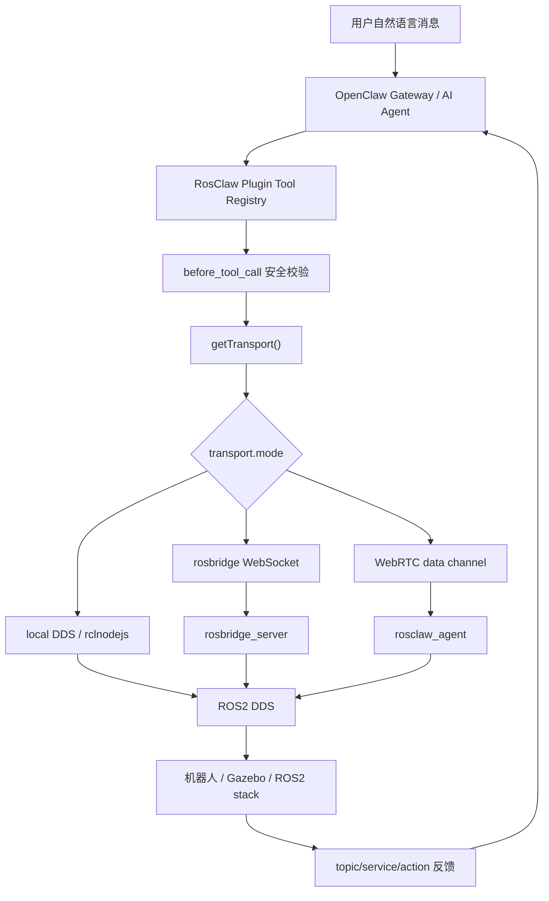

# RosClaw 项目技术调研报告

## 1. 调研结论概览

RosClaw 的目标不是单独实现一个机器人控制程序，而是把 OpenClaw 的消息入口、AI Agent 和工具调用机制接入 ROS2。用户在 WhatsApp、Telegram、Discord、Slack 或 OpenClaw 原生应用中发出自然语言请求后，OpenClaw Agent 选择 RosClaw 插件注册的 ROS2 工具，再通过 topic、service、action 等 ROS2 通信机制控制机器人或读取机器人状态。

从当前仓库看，项目处于原型到早期工程化之间：

- **已实现并可作为主线分析的部分**：OpenClaw 插件主体、rosbridge WebSocket transport、ROS2 topic 发布/订阅、service 调用、action 调用接口、topic/service/action introspection、基础安全限速、`/estop` 和 `/transport` 命令、ROS2 discovery node。
- **有代码雏形但需要进一步闭环的部分**：local DDS transport、WebRTC transport、机器人端 `rosclaw_agent`、ROS2 action 的真实机器人验证、动态 capability 上下文。
- **主要停留在文档或占位的部分**：Canvas/A2UI 实时仪表盘、机械臂抓取 demo、多机器人巡检 demo、完整 Nav2/MoveIt2 应用示例、云端机器人租赁或门户能力。

因此，`REPRODUCTION.md` 中的 TurtleBot3/Gazebo 复现只能证明 **rosbridge + ROS2/Gazebo 移动底盘控制链路** 是可跑通的一个子集。完整项目分析必须覆盖 OpenClaw 插件、三种 transport、ROS2 工作区、Docker、示例和未实现模块。

## 2. 项目结构与模块职责

当前仓库主要由 TypeScript OpenClaw 插件、ROS2 Python 包、Docker 部署文件和示例文档组成。

```text
rosclaw/
├── extensions/
│   ├── openclaw-plugin/      # OpenClaw 主插件，项目核心
│   └── openclaw-canvas/      # Canvas/A2UI 仪表盘扩展，目前是 Phase 3 占位
├── ros2_ws/src/
│   ├── rosclaw_agent/        # WebRTC 远程模式的机器人端 ROS2 bridge node
│   ├── rosclaw_discovery/    # ROS2 graph capability discovery node
│   └── rosclaw_msgs/         # capability manifest 自定义 msg/srv
├── docker/                   # ROS2、rosbridge、Gazebo、插件镜像配置
├── examples/                 # TurtleBot、arm-control、fleet-patrol 示例说明
├── scripts/                  # workspace setup、transport 验证脚本
├── docs/                     # 架构文档
├── README.md                 # 项目宣称能力和快速开始
└── REPRODUCTION.md           # 已复现链路记录，作为验证证据之一
```

需要注意，`README.md` 中的结构仍提到 `packages/rosbridge-client/` 等目录，但当前 `pnpm-workspace.yaml` 只包含 `extensions/*`，仓库根目录也不存在 `packages/`。这说明文档和代码经历过重构但没有完全同步。

## 3. OpenClaw 在项目中的具体作用

OpenClaw 在 RosClaw 中承担的是 **人机交互入口、AI Agent 编排和插件运行时**，而不是 ROS2 底层通信本身。

核心入口在 `extensions/openclaw-plugin/src/index.ts`。该文件导出 OpenClaw plugin 对象，在 `register(api)` 中完成以下注册：

- `parseConfig()`：读取并校验插件配置，实现在 `extensions/openclaw-plugin/src/config.ts`。
- `registerService()`：把 ROS2 transport 注册为 OpenClaw managed service，实现在 `extensions/openclaw-plugin/src/service.ts`。
- `registerTools()`：向 OpenClaw Agent 注册 ROS2 工具，实现在 `extensions/openclaw-plugin/src/tools/index.ts`。
- `registerSafetyHook()`：注册 `before_tool_call` 安全 hook，实现在 `extensions/openclaw-plugin/src/safety/validator.ts`。
- `registerRobotContext()`：注册 `before_agent_start` 上下文注入，实现在 `extensions/openclaw-plugin/src/context/robot-context.ts`。
- `registerEstopCommand()` 和 `registerTransportCommand()`：注册绕过 AI 或管理连接的直接命令，实现在 `extensions/openclaw-plugin/src/commands/`。

`extensions/openclaw-plugin/src/plugin-api.ts` 定义了 RosClaw 预期使用的 OpenClaw 插件 API，包括：

- `registerTool()`：把 ROS2 操作暴露给 Agent。
- `registerService()`：管理 transport 生命周期。
- `registerCommand()`：注册 `/estop`、`/transport` 这类直接命令。
- `on("before_tool_call")`：在工具执行前拦截危险操作。
- `on("before_agent_start")`：在 Agent 启动前注入机器人 capability context。

因此，OpenClaw 的具体作用可以概括为：接收用户自然语言消息，维护会话和 Agent，允许 RosClaw 插件把 ROS2 能力注册成工具，并在 Agent 调用工具时提供 hook、配置、日志、命令和服务生命周期管理。

## 4. 运行流程分析

### 4.1 插件加载流程

插件加载时的链路是：

```text
OpenClaw runtime
-> extensions/openclaw-plugin/src/index.ts
-> parseConfig()
-> registerService()
-> registerTools()
-> registerSafetyHook()
-> registerRobotContext()
-> registerEstopCommand()
-> registerTransportCommand()
```

`extensions/openclaw-plugin/src/config.ts` 使用 Zod 定义配置，包括：

- `transport.mode`：`rosbridge`、`local`、`webrtc`，默认 `rosbridge`。
- `rosbridge.url`：默认 `ws://localhost:9090`。
- `local.domainId`：ROS_DOMAIN_ID，默认 `0`。
- `webrtc.signalingUrl`、`apiUrl`、`robotId`、`robotKey`、`iceServers`。
- `robot.name`、`robot.namespace`。
- `safety.maxLinearVelocity`、`maxAngularVelocity`、`workspaceLimits`。

`service.ts` 按配置创建 transport 并连接。工具执行时并不直接知道底层通信方式，而是统一调用 `getTransport()`。

### 4.2 Agent 工具调用流程

RosClaw 注册的工具在 `extensions/openclaw-plugin/src/tools/`：

| 工具 | 文件 | 作用 | 实现状态 |
|---|---|---|---|
| `ros2_publish` | `ros2-publish.ts` | 向任意 ROS2 topic 发布消息 | 已实现 |
| `ros2_subscribe_once` | `ros2-subscribe.ts` | 订阅 topic 并返回下一条消息 | 已实现 |
| `ros2_service_call` | `ros2-service.ts` | 调用 ROS2 service | 已实现 |
| `ros2_action_goal` | `ros2-action.ts` | 发送 ROS2 action goal 并等待结果 | 工具已实现，真实 action 场景仍需验证 |
| `ros2_param_get` / `ros2_param_set` | `ros2-param.ts` | 通过 ROS2 参数 service 读写参数 | 已实现接口 |
| `ros2_list_topics` | `ros2-introspect.ts` | 查询 topic 和类型 | 已实现 |
| `ros2_camera_snapshot` | `ros2-camera.ts` | 从 compressed image topic 取一帧 | 已实现接口，依赖环境提供相机 topic |

典型运行过程如下：



### 4.3 反馈路径

反馈不是由单独的业务层处理，而是沿 ROS2 原生通信形式返回：

- topic 数据：`subscribe()` 收到 rosbridge `publish` 或 local DDS subscription callback。
- service 返回：`callService()` 等待 `service_response` 或 rclnodejs/rclpy service response。
- action 返回：`sendActionGoal()` 等待 action result，feedback 可通过回调流式返回。
- Agent 输出：OpenClaw 将工具返回的 JSON/text details 转为对用户的回复或后续推理输入。

## 5. Transport 层分析

Transport 抽象是项目工程设计中最关键的部分。`extensions/openclaw-plugin/src/transport/transport.ts` 定义统一接口：

- `connect()` / `disconnect()` / `getStatus()` / `onConnection()`
- `publish()`
- `subscribe()`
- `callService()`
- `sendActionGoal()` / `cancelActionGoal()`
- `listTopics()` / `listServices()` / `listActions()`

`extensions/openclaw-plugin/src/transport/factory.ts` 根据 `config.mode` 动态加载具体实现，避免无关依赖总是被加载。

### 5.1 rosbridge 模式

代码目录：`extensions/openclaw-plugin/src/transport/rosbridge/`

这是当前最成熟、最容易复现的路径。它通过 WebSocket 连接 `rosbridge_server`，把工具调用转成 rosbridge JSON：

- `adapter.ts`：实现 `RosbridgeTransport`，把统一接口转发到 rosbridge client、topic helper、service helper 和 action client。
- `client.ts`：维护 WebSocket 生命周期、重连、pending request、message routing。
- `topics.ts`：发送 `op: "publish"`、`op: "subscribe"`、`op: "unsubscribe"`。
- `services.ts`：发送 `op: "call_service"` 并等待 `service_response`。
- `actions.ts`：发送 `op: "send_action_goal"` 和 `cancel_action_goal`。

`REPRODUCTION.md` 中验证的链路属于该模式：

```text
宿主机 Node
-> RosbridgeTransport
-> ws://127.0.0.1:9090
-> rosbridge_server
-> ROS2 /cmd_vel
-> ros_gz_bridge
-> Gazebo TurtleBot3
-> /odom 反馈
```

这条链路证明了 rosbridge transport 可以实际驱动 Gazebo 中的 TurtleBot3，但它只是整个项目的一部分。

### 5.2 local DDS 模式

代码目录：`extensions/openclaw-plugin/src/transport/local/`

该模式用于 OpenClaw 与机器人运行在同一台机器上时，通过 `rclnodejs` 直接接入本机 ROS2 DDS，不经过 WebSocket。

关键文件：

- `transport.ts`：创建 rclnodejs node `rosclaw_local`，实现 publisher、subscription、service client、action client 和 ROS graph introspection。
- `conversion.ts`：在普通 JS object 与 rclnodejs typed message 之间转换。
- `entities.ts`：缓存 publisher、subscription、service client，避免重复创建实体。

从代码看，local 模式已经不是空 stub，而是有较完整实现。但它依赖本机 Node 环境能正确加载 `rclnodejs`，并且需要 source ROS2 工作区。`extensions/openclaw-plugin/package.json` 将 `rclnodejs` 放在 `optionalDependencies` 中，`REPRODUCTION.md` 也指出没有 source ROS 环境时该依赖可能编译失败。因此该模式的成熟度应标为 **代码实现较完整，但环境门槛高，仍需专门验证**。

### 5.3 WebRTC 模式

代码目录：

- 云侧插件：`extensions/openclaw-plugin/src/transport/webrtc/`
- 机器人侧节点：`ros2_ws/src/rosclaw_agent/rosclaw_agent/agent_node.py`

WebRTC 模式用于 OpenClaw 在云端、机器人在 NAT 或防火墙后的场景。设计目标是通过 signaling server 建立 WebRTC data channel，把 rosbridge 风格 JSON 发送到机器人端，再由 `rosclaw_agent` 转成 ROS2 DDS 操作。

云侧 `WebRTCTransport` 的流程：

1. 通过 REST API 请求连接机器人。
2. 连接 signaling WebSocket。
3. 加入 room。
4. 等待机器人端 SDP offer。
5. 创建 answer，交换 ICE candidate。
6. data channel 打开后发送 `publish`、`subscribe`、`call_service`、`send_action_goal` 等 JSON。

机器人侧 `RosClawAgentNode` 的流程：

1. 读取 `ROSCLAW_SIGNALING_URL`、`ROSCLAW_ROBOT_TOKEN`、`ROSCLAW_ROBOT_KEY`、`ROSCLAW_ROBOT_ID`。
2. 通过 WebSocket 连接 signaling server。
3. 接受 session invitation。
4. 创建 aiortc peer connection 和 data channel。
5. 解析 data channel 中的 rosbridge JSON。
6. 使用 rclpy 创建 publisher、subscription、service client、action client。

该模式体现了完整的远程控制设计，但当前仓库缺少 signaling server 实现、端到端部署配置和远程验收记录。`agent_node.py` 中 `_handle_ice_candidate()` 目前主要记录 candidate，注释也说明实现较简化；`_handle_cancel_action_goal()` 也明确写着需要跟踪 goal handle，属于未来增强。因此 WebRTC 模式应标为 **有较完整架构骨架，但没有闭环验证**。

## 6. ROS2 工作区分析

### 6.1 rosclaw_msgs

目录：`ros2_ws/src/rosclaw_msgs/`

该包定义 capability discovery 所需的自定义消息和服务：

- `msg/CapabilityManifest.msg`
  - `robot_name`
  - `robot_namespace`
  - `topic_names` / `topic_types`
  - `service_names` / `service_types`
  - `action_names` / `action_types`
  - `stamp`
- `srv/GetCapabilities.srv`
  - request：`robot_namespace`
  - response：`manifest`、`success`、`error_message`

它的作用是为 ROS2 侧能力发现提供结构化数据，而不是直接控制机器人。

### 6.2 rosclaw_discovery

目录：`ros2_ws/src/rosclaw_discovery/`

核心文件：`ros2_ws/src/rosclaw_discovery/rosclaw_discovery/discovery_node.py`

该 node 名为 `rosclaw_discovery`，主要功能：

- 定期扫描 ROS2 graph。
- 发布 `/rosclaw/capabilities`，消息类型为 `rosclaw_msgs/msg/CapabilityManifest`。
- 提供 `/rosclaw/get_capabilities` service，类型为 `rosclaw_msgs/srv/GetCapabilities`。
- 可通过 `robot_namespace` 参数过滤 topic/service/action。
- 通过查找 `*/_action/feedback` topic 推断 action server。

它体现了项目想让 Agent 自动理解机器人能力的方向。不过当前 OpenClaw 插件中的 `robot-context.ts` 是直接通过 transport 的 `listTopics()`、`listServices()`、`listActions()` 做 discovery，并没有强依赖 `/rosclaw/capabilities` topic。因此 `rosclaw_discovery` 更像 ROS2 侧能力清单基础设施，尚未完全成为插件主流程的唯一数据源。

### 6.3 rosclaw_agent

目录：`ros2_ws/src/rosclaw_agent/`

核心文件：`ros2_ws/src/rosclaw_agent/rosclaw_agent/agent_node.py`

该 node 是 WebRTC 远程模式的机器人端桥接器。它不是 OpenClaw Agent，而是运行在机器人上的 ROS2 node，负责把 WebRTC data channel 上收到的 rosbridge 风格 JSON 转成 rclpy 操作。

已实现能力包括：

- publish：创建 publisher 并发布本地 ROS2 topic。
- subscribe：创建 subscription，把 ROS2 消息转成 dict 后通过 data channel 发回。
- call_service：创建 service client，处理 `/rosapi/topics`、`/rosapi/services` 两个 introspection 特例。
- send_action_goal：创建 rclpy action client，发送 goal，返回 feedback/result。

限制包括：

- 缺少仓库内 signaling server。
- ICE candidate 处理较简化。
- action cancellation 仅记录日志，未真正跟踪并取消 goal handle。
- 远程模式没有像 rosbridge 模式那样的复现记录。

## 7. 机器人与任务能力分析

### 7.1 当前可确认接入的机器人

当前仓库中实际可确认、且已有复现证据的机器人是 **TurtleBot3 Burger Gazebo 仿真机器人**。相关证据：

- `docker/Dockerfile.ros2` 安装 `ros-jazzy-turtlebot3-gazebo`、`ros-jazzy-turtlebot3-navigation2`、`ros-jazzy-nav2-bringup`。
- `docker/docker-compose.yml` 设置 `TURTLEBOT3_MODEL=burger` 并暴露 rosbridge `9090`。
- `REPRODUCTION.md` 记录了手动启动 TurtleBot3 headless Gazebo、创建 burger 模型、桥接 `/cmd_vel`、读取 `/odom`、`/scan`、`/imu` 的流程。

TurtleBot3 Burger 是差速移动底盘，不是机械臂。它可被控制的主要运动能力是：

- 前进/后退线速度：通常体现在 `linear.x`。
- 原地或弧线转向角速度：通常体现在 `angular.z`。
- 通过速度积分和底层仿真/控制反馈产生二维平面位姿变化。

从控制接口角度看，它不是一个 6 自由度机械臂，而是移动机器人底盘。常见描述可以写为：在二维平面中具备位姿状态 `(x, y, yaw)`，底层直接控制输入主要是线速度 `v` 和角速度 `omega` 两个量。`REPRODUCTION.md` 中当前 Gazebo bridge 下 `/cmd_vel` 类型是 `geometry_msgs/msg/TwistStamped`，这和插件默认示例中的 `geometry_msgs/msg/Twist` 存在差异。

### 7.2 当前可完成的任务

基于当前代码和复现记录，可以确认或合理支持的任务包括：

- **速度控制**：通过 `ros2_publish` 向 `/cmd_vel` 发布速度命令。rosbridge 路径已在 TurtleBot3 Gazebo 中验证。
- **停止机器人**：`/estop` 命令向 `/cmd_vel` 发送零速度，但当前实现固定使用 `geometry_msgs/msg/Twist`，在 `TwistStamped` 环境中可能需要适配。
- **读取状态与传感器**：通过 `ros2_subscribe_once` 读取 `/odom`、`/scan`、`/imu`、`/battery_state`、`/diagnostics` 等 topic，前提是 ROS2 graph 中存在这些 topic。
- **调用服务**：通过 `ros2_service_call` 调用任意 ROS2 service，例如参数服务或其他行为触发服务。
- **参数读写**：通过 `ros2_param_get`、`ros2_param_set` 调用节点的 `get_parameters` 和 `set_parameters` service。
- **能力发现**：通过 `ros2_list_topics` 和 transport introspection 获取 ROS2 topic 列表；也可以运行 `rosclaw_discovery` 发布 capability manifest。
- **相机快照**：`ros2_camera_snapshot` 可从 `/camera/image_raw/compressed` 读取一帧 compressed image，但当前 TurtleBot3 复现记录没有验证相机 topic。

### 7.3 依赖外部 ROS2 stack 的任务

以下能力在 README、skills 或 examples 中出现，但不能简单视为当前项目自身已完整实现：

- **Nav2 导航**：`extensions/openclaw-plugin/skills/navigate-to/SKILL.md` 描述了使用 `navigate_to_pose` action 或 `/goal_pose` topic。插件有 `ros2_action_goal`，Docker 镜像安装了 Nav2 相关包，但报告中应写为“具备调用 Nav2 的接口基础，是否可导航取决于仿真/机器人是否启动 map、localization、planner、controller 等 Nav2 节点”。
- **MoveIt2 机械臂抓取**：`examples/arm-control/README.md` 和 `skills/pick-object/SKILL.md` 均明确写着 Phase 2，需要 MoveIt2 action integration，尚未实现完整 demo。
- **电池状态**：`skills/check-status/SKILL.md` 建议读取 `/battery_state`，但是否有真实数据取决于机器人或仿真是否发布该 topic。
- **多机器人巡检**：`examples/fleet-patrol/README.md` 标注 Phase 3，需要多机器人 namespace 支持和 cron scheduling。当前插件有 `robot.namespace` 过滤和 topic 前缀思路，但没有完整 fleet 管理实现。
- **实时仪表盘/遥操作**：`extensions/openclaw-canvas/README.md` 描述 Canvas/A2UI 仪表盘，但 `extensions/openclaw-canvas/index.ts` 只打印加载日志，未实现 UI 和 gateway method。

## 8. 安全机制分析

安全相关实现集中在 `extensions/openclaw-plugin/src/safety/validator.ts` 和 `extensions/openclaw-plugin/src/commands/estop.ts`。

`validator.ts` 注册 `before_tool_call` hook，只在工具名为 `ros2_publish` 时检查消息内容：

- 如果消息包含 `linear`，计算三维线速度模长，超过 `safety.maxLinearVelocity` 则阻断。
- 如果消息包含 `angular`，检查 `angular.z`，超过 `safety.maxAngularVelocity` 则阻断。
- 文件中 TODO 明确表示导航 goal 的 workspace limit 检查尚未实现。

该机制的优点是能在 Agent 发出 topic 命令前做基础限速；缺点也很明显：

- 只检查 `ros2_publish`，不覆盖 service、action、参数修改等潜在危险操作。
- 假设速度消息是 `Twist` 结构，即顶层有 `linear` 和 `angular`；如果实际消息是 `TwistStamped`，速度字段在 `twist.linear` 和 `twist.angular` 下，当前 hook 可能无法正确拦截。
- 只检查 `angular.z`，不检查 roll/pitch 相关角速度。
- `workspaceLimits` 已在 config 中定义，但没有真正用于 Nav2 goal 或 PoseStamped 校验。

`/estop` 的实现能绕过 AI Agent 直接发零速度命令，这是正确方向。但它同样固定发送 `geometry_msgs/msg/Twist` 到 `/cmd_vel`，在当前复现的 `TwistStamped` Gazebo bridge 场景中存在类型不匹配风险。

## 9. Docker、脚本和复现支撑

### 9.1 Docker

`docker/Dockerfile.ros2` 是较有价值的部署文件：

- 基于 `ros:jazzy-ros-base`。
- 安装 `ros-jazzy-rosbridge-suite`、`ros-jazzy-turtlebot3-gazebo`、`ros-jazzy-turtlebot3-navigation2`、`ros-jazzy-nav2-bringup`。
- 复制 `rosclaw_discovery`、`rosclaw_msgs`、`rosclaw_agent`。
- 在 `/ros2_ws` 中执行 `colcon build --symlink-install`。
- 默认启动 `rosbridge_server`。

`docker/docker-compose.yml` 定义 `ros2` 和 `rosclaw` 两个服务，并暴露 `9090`。但 `REPRODUCTION.md` 已经记录：默认 compose 只启动 rosbridge/rosapi，不会自动启动 TurtleBot3 Gazebo，需要手动进入容器启动 headless Gazebo、创建模型、启动 `ros_gz_bridge`。

`docker/Dockerfile.rosclaw` 当前存在明显结构问题：它复制 `packages/transport/package.json`、`packages/rosbridge-client/package.json`、`packages/transport-local/package.json`、`packages/transport-webrtc/package.json`，但当前仓库没有 `packages/` 目录。这会导致该 Dockerfile 在当前仓库状态下构建失败。

### 9.2 scripts

`scripts/reproduce-rosbridge.mjs` 是一个轻量 mock rosbridge 验证脚本。它不依赖真实 ROS2，而是在本地启动 WebSocket server，验证：

- `listTopics()`
- `listActions()`
- `publish()`
- `subscribe()`
- `callService()`

这适合验证 TypeScript rosbridge transport 的基本协议行为，但不能替代真实 ROS2/Gazebo 验证。

`scripts/test-rclnodejs.mts` 用于验证 rclnodejs ESM/CJS 加载、node 创建、publisher/subscription 等，说明项目曾经针对 local DDS 路径做过依赖原型验证。

`scripts/setup_workspace.sh` 和 `scripts/activate_workspace.sh` 是环境准备脚本，辅助在 ROS2/Node 环境中安装和激活工作区。

## 10. 示例与规划功能

`examples/turtlebot-chat/README.md` 是最接近当前可运行主线的示例，描述通过 OpenClaw -> RosClaw plugin -> rosbridge -> Gazebo TurtleBot3 控制移动机器人。

`examples/arm-control/README.md` 明确标注 Phase 2，依赖 MoveIt2 action integration，当前不应写成已实现机械臂控制能力。

`examples/fleet-patrol/README.md` 明确标注 Phase 3，依赖多机器人 namespace 支持和 cron scheduling，当前不应写成已实现 fleet patrol。

`extensions/openclaw-plugin/skills/` 中的 skill 文件更像 Agent 使用工具时的提示说明：

- `navigate-to/SKILL.md`：描述 Nav2 导航流程。
- `check-status/SKILL.md`：描述读取 battery、odom、diagnostics、scan、camera。
- `take-photo/SKILL.md`：描述相机快照。
- `pick-object/SKILL.md`：明确标注 MoveIt2 抓取仍是 Phase 2。

这些 skill 文件说明了项目希望 Agent 如何调用工具，但它们不是 ROS2 行为本身的实现。

## 11. Canvas/A2UI 仪表盘扩展

目录：`extensions/openclaw-canvas/`

`extensions/openclaw-canvas/README.md` 描述了一个未来的实时机器人仪表盘：

- live camera feeds
- telemetry
- joystick teleoperation
- map visualization
- emergency stop button
- topic/service browser
- Nav2 progress visualization

但 `extensions/openclaw-canvas/index.ts` 当前只有：

```ts
export function register(api: OpenClawPluginAPI): void {
  api.log.info("RosClaw Canvas extension loaded (Phase 3 - not yet implemented)");
}
```

因此 Canvas 扩展当前是占位模块。它对理解项目长期方向有价值，但不能计入已实现功能。

## 12. 功能成熟度矩阵

| 能力 | 主要文件/目录 | 成熟度 | 说明 |
|---|---|---|---|
| OpenClaw 插件注册 | `extensions/openclaw-plugin/src/index.ts` | 已实现 | 注册 service、tools、hooks、commands |
| 配置校验 | `src/config.ts` | 已实现 | Zod schema，默认 transport 为 rosbridge |
| rosbridge transport | `src/transport/rosbridge/` | 已实现并有复现证据 | 当前最可靠路径 |
| local DDS transport | `src/transport/local/` | 有较完整代码，需环境验证 | 依赖 rclnodejs 和 ROS2 source 环境 |
| WebRTC transport | `src/transport/webrtc/` | 架构骨架完整，未闭环 | 缺少 signaling server 和端到端验证 |
| 机器人端 WebRTC bridge | `ros2_ws/src/rosclaw_agent/` | 有代码雏形，未闭环 | publish/subscribe/service/action 均有实现，但 ICE/cancel 等不完整 |
| ROS2 capability discovery | `ros2_ws/src/rosclaw_discovery/` | 已实现 | 发布 manifest 和提供 service |
| 自定义 msg/srv | `ros2_ws/src/rosclaw_msgs/` | 已实现 | capability manifest 数据结构 |
| 基础 topic/service/action 工具 | `src/tools/` | 已实现接口 | action/camera 取决于 ROS2 环境 |
| 安全限速 | `src/safety/validator.ts` | 部分实现 | 仅覆盖部分 `ros2_publish` 速度结构 |
| `/estop` | `src/commands/estop.ts` | 部分实现 | 固定 Twist，可能不适配 TwistStamped |
| `/transport` | `src/commands/transport.ts` | 已实现 | 可查看和切换 transport |
| TurtleBot3 Gazebo 示例 | `examples/turtlebot-chat/`、`REPRODUCTION.md` | 部分验证 | rosbridge 速度控制链路已验证 |
| Nav2 导航 | `skills/navigate-to/`、Docker Nav2 包 | 接口基础，未完整验收 | 需要完整 Nav2 runtime |
| MoveIt2 抓取 | `skills/pick-object/`、`examples/arm-control/` | 规划中 | Phase 2 |
| 多机器人巡检 | `examples/fleet-patrol/` | 规划中 | Phase 3 |
| Canvas 仪表盘 | `extensions/openclaw-canvas/` | 占位 | Phase 3 |
| 插件 Docker 镜像 | `docker/Dockerfile.rosclaw` | 当前疑似不可构建 | 引用不存在的 `packages/` |

## 13. 项目优势

1. **OpenClaw 工具化接口清晰**

   RosClaw 没有把自然语言解析逻辑和 ROS2 通信硬编码在一起，而是把 ROS2 操作注册为 Agent tools。这符合 Agent 平台的扩展方式，也方便未来增加新工具。

2. **ROS2 操作抽象比较通用**

   `ros2_publish`、`ros2_subscribe_once`、`ros2_service_call`、`ros2_action_goal` 基本覆盖 ROS2 常见通信模式。理论上只要机器人暴露标准 topic/service/action，Agent 就可以调用。

3. **transport 分层合理**

   `RosTransport` 接口把工具层和通信层解耦，使 rosbridge、local DDS、WebRTC 三种部署模式可以复用同一套 Agent tools。

4. **具备 capability discovery 设计**

   TypeScript 插件可通过 transport introspection 注入上下文，ROS2 侧也有 `rosclaw_discovery` 发布 capability manifest。这说明项目不只是静态写死 `/cmd_vel`，而是有动态发现机器人能力的方向。

5. **rosbridge 路径有真实验证价值**

   `REPRODUCTION.md` 已证明 TypeScript `RosbridgeTransport` 可以通过 `ws://127.0.0.1:9090` 发布 `/cmd_vel` 并驱动 Gazebo TurtleBot3，说明核心通信链路不是纯文档。

## 14. 项目缺陷与风险

1. **文档与实际仓库结构不一致**

   `README.md` 和 `docker/Dockerfile.rosclaw` 提到 `packages/` 下的多个包，但当前仓库不存在这些目录，`pnpm-workspace.yaml` 也只包含 `extensions/*`。

2. **Docker 主线不完整**

   `docker/docker-compose.yml` 启动 rosbridge，但不会自动启动 Gazebo TurtleBot3、创建机器人、启动 ros_gz_bridge。复现需要额外手动步骤。

3. **消息类型假设不一致**

   插件和 README 多处默认 `/cmd_vel` 是 `geometry_msgs/msg/Twist`，但当前 Gazebo bridge 复现中 `/cmd_vel` 是 `geometry_msgs/msg/TwistStamped`。这会影响 `ros2_publish` 示例、`/estop` 和安全校验。

4. **安全机制覆盖不足**

   当前只检查部分 `ros2_publish` velocity 字段，不覆盖 action goal、service call、parameter set、workspace limits，也不适配嵌套的 `TwistStamped`。

5. **WebRTC 远程模式缺少闭环**

   云侧和机器人侧代码都存在，但仓库缺少 signaling server、完整部署说明和端到端验收。ICE candidate 和 action cancel 也有明显未完成点。

6. **Canvas、机械臂、多机器人主要是规划**

   `extensions/openclaw-canvas/`、`examples/arm-control/`、`examples/fleet-patrol/` 都明确处于 Phase 2/Phase 3 或 not implemented。报告和对外介绍需要避免夸大。

7. **OpenClaw 上游运行时不可在本仓库独立验证**

   当前仓库定义了插件侧 API 类型和实现，但没有包含完整 OpenClaw Gateway。也就是说，可以验证 transport 和 ROS2 通信，但完整“消息 app -> OpenClaw Agent -> RosClaw -> robot”的生产链路需要 OpenClaw 环境配合。

## 15. 后续调研与改进建议

优先级较高的后续工作：

1. 修复文档和 Dockerfile 中的 `packages/` 结构漂移问题。
2. 明确 `/cmd_vel` 类型适配策略：支持 `Twist` 和 `TwistStamped`，并让 `/estop` 与 safety hook 同步适配。
3. 把 TurtleBot3 Gazebo 启动、模型创建、ros_gz_bridge 启动固化到 Docker Compose 或 launch 文件中，减少手动复现步骤。
4. 为 rosbridge transport 增加真实 ROS2 集成测试或至少保留 mock rosbridge 回归测试。
5. 明确 local DDS 模式的 rclnodejs 安装和验证流程。
6. 如果要主推远程机器人能力，需要补齐 signaling server、WebRTC 端到端部署和安全认证方案。
7. 对 Nav2 做一个完整 demo：map/localization/planner/controller/action goal/status feedback。
8. 暂时不要把 Canvas、MoveIt2、多机器人巡检作为已实现卖点，除非后续补齐对应代码和验收。

## 16. 总结

RosClaw 当前最扎实的核心是 **OpenClaw 插件层 + ROS2 transport 抽象 + rosbridge 通信路径**。它已经具备把 AI Agent 工具调用映射为 ROS2 topic/service/action 操作的基本能力，也能通过 rosbridge 驱动 TurtleBot3 Gazebo 这类移动机器人。

但项目整体仍处于快速演进阶段。README 中提到的自然语言控制、Nav2、MoveIt2、远程租赁、多机器人、实时仪表盘等能力并不处于同一成熟度。准确评价该项目时，应把它看作一个 OpenClaw-ROS2 集成原型平台：底层抽象设计较完整，rosbridge 路径可验证，local/WebRTC/Canvas/高级机器人任务仍需要进一步工程化和验收。
